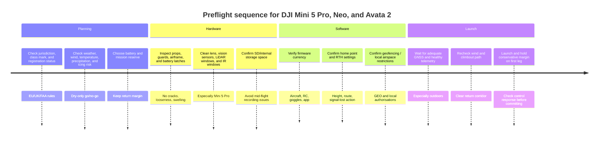

# Drone RAG Knowledge Corpus for DJI Mini 5 Pro, DJI Neo, and DJI Avata 2

## Executive summary

This report is designed as both a technical reference and a corpus blueprint for a retrieval-augmented generation system focused on three DJI consumer drones: DJI Mini 5 Pro, DJI Neo, and DJI Avata 2. The strongest official source base is DJI's own specs pages, user manuals, safety guidelines, release notes, and FAQs. For regulatory context, the highest-confidence external sources are FAA, EASA, and UK CAA publications. For weather and battery behaviour beyond what DJI publishes, the most useful evidence comes from peer-reviewed work on lithium-ion low-temperature behaviour, multirotor wind disturbance rejection, icing on rotary-wing UAVs, and multirotor hover/endurance modelling.

At an airframe level, Mini 5 Pro is the most capable of the three for conventional imaging work. Its official spec stack includes a 1-inch 50 MP camera, a 3-axis mechanical gimbal, O4+ transmission, omnidirectional binocular vision supplemented by forward LiDAR and a downward infrared sensor, C0 classification in Europe with the standard battery, and official wind resistance of 12 m/s. DJI also publishes two battery variants for it: a standard 2788 mAh pack and a 4680 mAh Plus pack, with official max flight times of 36 and 52 minutes respectively. The Plus pack is explicitly not sold in Europe and pushes the aircraft out of the EU C0 regime.

DJI Neo is the lightest and simplest platform here. DJI positions it as a palm-sized 135 g vlogging drone with integrated propeller protection, a 1/2-inch camera, single-axis tilt gimbal, C0 classification in Europe, official wind resistance of 8 m/s, and beginner-focused operation including palm control and app control. Its weakness is safety stack depth: DJI explicitly states that Neo does **not** have obstacle avoidance, and the reviewed official specs expose only downward visual positioning rather than the richer sensing packages found on the other two airframes. Its RC-linked transmission can reach 10 km with DJI RC-N3, RC-N2, or RC 2, but direct app control is limited to 50 m effective operating range.

DJI Avata 2 sits between the two in imaging complexity but is the most specialised operationally. It is a 377 g FPV drone with integrated propeller guards, a 1/1.3-inch camera, an FPV-oriented 155° field of view, single-axis tilt gimbal, O4 video transmission to goggles, official wind resistance of 10.7 m/s, 2150 mAh 4-cell Li-ion battery, C1 classification in Europe, and support for Smart RTH, Low Battery RTH, and Failsafe RTH. DJI explicitly says it does **not** support obstacle avoidance, although it does use downward and backward visual positioning for safety in Normal and Sport modes. It is the least suitable of the three for casual beginners unless flown with the motion controller and beginner protections, and the most suitable for immersive FPV use.

For a Drone RAG corpus, the key engineering point is that DJI does **not** publish many component-level internals that advanced users often want, including motor KV, propeller dimensions, ESC design, flight-controller part numbers, IMU model, compass model, barometer model, internal resistance, discharge C-rates, control-loop frequencies, noise-density figures, or MTBF. A rigorous corpus should therefore represent these explicitly as `unspecified`, not as missing values to be hallucinated. Where derivative estimates are useful, such as endurance sensitivity to added payload or density altitude, they should be stored as a separate derived layer with a provenance tag such as `derived_from_rotor_model`, never merged into the official-spec layer.

## Corpus design for a drone RAG

The corpus should be built as a layered, provenance-first knowledge graph rather than a flat collection of PDF chunks. The practical split that works best for these three airframes is:

| Layer | What it contains | Trust level | Ingestion rule |
|---|---|---:|---|
| Official product layer | Specs pages, FAQs, manuals, safety guidelines, release notes | Highest | Preserve exact wording where useful, normalise units, never infer missing internals |
| Regulatory layer | FAA Remote ID and registration rules, EASA open-category rules, UK CAA class-mark guidance | Highest | Keep region-tagged and date-tagged |
| Scientific layer | Peer-reviewed battery, wind, icing, and endurance papers | High | Use for cross-cutting physics, not for back-filling unpublished DJI internals |
| Derived engineering layer | Payload-endurance estimates, density-altitude penalties, mission profiles | Medium | Store equations, assumptions, and uncertainty explicitly |
| Operational risk layer | Hazard registers, mitigations, pre-flight logic | Medium | Mark as `inference_from_official_warnings` when not directly stated by DJI |

For ingestion, each fact should carry at least these fields:

```yaml
entity_id: dji_mini_5_pro
attribute: max_wind_resistance
value: 12
unit: m/s
source_type: official_specs
source_ref: DJI Mini 5 Pro Specs
jurisdiction: global
valid_as_of: 2026-06-17
confidence: high
derivation: none
notes: "Official published value"
```

A second class of records should capture absence, because absence is material in this domain:

```yaml
entity_id: dji_avata_2
attribute: motor_kv
value: unspecified
source_type: official_docs_reviewed
confidence: high
derivation: none
notes: "Not published in reviewed DJI official material"
```

This matters because an LLM will otherwise try to "complete" the record. For these DJI consumer platforms, that is precisely how technical hallucinations happen. The reviewed official documents are rich on operation, imaging, and regulatory fit, but sparse on propulsion-electronics internals and control-loop internals.

A useful schema for weather-aware retrieval is to split each model into five retrieval clusters: `airframe_and_propulsion`, `camera_and_gimbal`, `sensing_and_control`, `battery_and_endurance`, and `regulation_and_safety`. That lets a query such as "Can the Neo tolerate cold windy drizzle?" retrieve the official "no rain" warning, the official 8 m/s wind limit, the official -10 to 40 °C operating range, and the scientific low-temperature battery evidence without mixing in unrelated camera details.

For derived endurance estimates, keep the official laboratory value distinct from the engineering estimate. A compact first-order model for hover-endurance sensitivity is:

```text
T_est ≈ T_ref × (W_ref / W_new)^(3/2) × (ρ / ρ0)^(1/2) × η_rel
```

Where `T_ref` is the published reference endurance, `W_new` includes payload, `ρ` is local air density, and `η_rel` is a catch-all efficiency factor for mission profile, gusts, and camera load. This comes from standard actuator-disk and multirotor power modelling logic and is suitable for a derived layer only, not for replacing official DJI claims.

## Comparative overview

### Consolidated comparison

| Drone | Approx. takeoff weight | Max takeoff altitude | Official max flight time | Official max wind resistance | Video transmission range | Battery type | EU class | Key official caveat | Source |
|---|---:|---:|---:|---:|---|---|---|---|---|
| DJI Mini 5 Pro | 249.9 g | 6000 m with standard battery, 4500 m with Plus battery | 36 min standard, 52 min Plus | 12 m/s | O4+, up to 20 km FCC, 10 km CE | Li-ion, NMC chemistry, standard and Plus variants | C0 with standard battery | Plus battery not sold in Europe and exceeds C0 regime in EU | |
| DJI Neo | 135 g | 2000 m | 18 min, or 17 min with prop guards on | 8 m/s | 50 m app control, or 10 km with RC-N3/RC-N2/RC 2 | Li-ion | C0 | No obstacle avoidance | |
| DJI Avata 2 | 377 g | 5000 m | 23 min | 10.7 m/s | O4, up to 13 km FCC, 10 km CE | Li-ion | C1 | Requires goggles, no obstacle avoidance, FPV-specific workflow | |

### Corpus-level interpretation

If the RAG is meant to answer "best technical all-rounder", Mini 5 Pro is the strongest answer. If it is meant to answer "safest beginner-entry casual follow-me vlogging platform", Neo is the strongest answer but must always return a safety caveat about absent obstacle avoidance. If it is meant to answer "best immersive FPV platform", Avata 2 is the strongest answer, but the answer should always surface goggles dependency, FPV-specific skill requirements, and the distinction between visual positioning and real obstacle avoidance.

## DJI Mini 5 Pro

### Technical specification profile

| Attribute | Value | Source |
|---|---|---|
| Airframe class | C0 in EU with standard battery | |
| Approx. takeoff weight | 249.9 g | |
| Dimensions | Folded 157 × 95 × 68 mm, unfolded 304 × 380 × 91 mm | |
| Max ascent speed | 10 m/s Sport, 6 m/s Normal, 3 m/s Cine | |
| Max descent speed | 8 m/s Sport with Plus battery, 6 m/s Sport with standard battery, 6 m/s Normal, 3 m/s Cine | |
| Max horizontal speed | 19 m/s Sport with Plus battery, 18 m/s Sport with standard battery, 15 m/s in tracking | |
| Max takeoff altitude | 6000 m with standard battery, 4500 m with Plus battery | |
| Max flight time | 36 min standard, 52 min Plus | |
| Operational mission endurance published by DJI | 21 min standard, 33 min Plus in DJI's "average flight time" scenario | |
| Max flight distance | 21 km standard, 32 km Plus | |
| Max wind resistance | 12 m/s | |
| GNSS | GPS + Galileo + BeiDou | |
| Internal storage | 42 GB | |
| Camera sensor | 1-inch CMOS, 50 MP effective | |
| Lens | 84° FOV, 24 mm equivalent, f/1.8, focus 0.5 m to ∞ | |
| Video | 4K up to 120 fps, FHD up to 240 fps, H.264/H.265, up to 130 Mb/s | |
| Photo formats | JPEG and DNG RAW | |
| Gimbal | 3-axis mechanical, tilt/roll/pan | |
| Gimbal ranges | Tilt -135° to 80°, roll -230° to 95°, pan -25° to 25° | |
| Gimbal controllable range | Tilt -90° to 55°, roll -180° to 45° | |
| Angular vibration range | ±0.005° | |
| Sensing | Omnidirectional binocular vision, forward LiDAR, downward infrared sensor | |
| Forward sensing | 0.5-18 m measurement, 0.5-200 m detection, effective flight speed ≤ 15 m/s | |
| LiDAR night range | 0.5-25 m at reflectivity >10% | |
| Video transmission | O4+ | |
| Live view | 1080p/30 or 1080p/60 on remote controller | |
| Max transmission distance | FCC 20 km, CE 10 km, SRRC 10 km, MIC 10 km | |
| Firmware versions reviewed | Aircraft v01.00.0600 current in reviewed release notes; earlier v01.00.0400 and v01.00.0300 also listed | |
| Motors | unspecified | |
| Propellers | unspecified | |
| ESCs | unspecified | |
| Flight controller | unspecified | |
| IMU | unspecified | |
| Compass | unspecified | |
| Barometer | unspecified | |
| Payload rating | unspecified | |
| Motor KV, torque, thrust curves, drag coefficients | unspecified | |

### Battery variants and endurance interpretation

| Attribute | Standard battery | Plus battery | Source |
|---|---:|---:|---|
| Capacity | 2788 mAh | 4680 mAh | |
| Mass | 71.2 g | 117 g | |
| Nominal voltage | 7.0 V | 7.16 V | |
| Max charge voltage | 8.6 V | 8.6 V | |
| Chemistry | Li-ion, LiNiMnCoO2 | Li-ion, LiNiMnCoO2 | |
| Energy | 19.52 Wh | 33.51 Wh | |
| Max flight time | 36 min | 52 min | |
| DJI average mission time | 21 min | 33 min | |
| Max flight distance | 21 km | 32 km | |
| Empty-to-full charge, in aircraft, 65 W charger | 69 min | 94 min | |
| Empty-to-full charge, hub, 65 W charger | 46 min | 56 min | |
| Three-pack full charge with hub | 115 min | 193 min | |
| EU availability | Sold in Europe | Not sold in Europe | |
| EU class impact | C0 | Exceeds C0 regime | |
| C-rating, internal resistance, discharge curve | unspecified | unspecified | |

The Mini 5 battery data tells a useful RAG story. The Plus pack increases stored energy by about 71.7%, from 19.52 Wh to 33.51 Wh, while increasing battery mass by about 64.3%, from 71.2 g to 117 g. The endurance gain is therefore real but sub-linear after the full airframe mass penalty is included, which is consistent with actuator-disk and multirotor endurance modelling.

For unsupported payload sensitivity, a first-order estimate using the hover-endurance scaling above gives the following **derived** baseline penalties. These are not DJI claims and should live in a derived corpus layer only. They assume unchanged propulsive efficiency and dry sea-level air.

| Configuration | Baseline official max flight time | Derived estimate with +20 g unsupported payload | Derived estimate with +50 g unsupported payload | Source basis |
|---|---:|---:|---:|---|
| Standard battery | 36 min | about 32.1 min | about 27.4 min | Official baseline from DJI, payload scaling derived from rotor/endurance models |
| Plus battery | 52 min | about 47.2 min | about 41.1 min | Official baseline from DJI, payload scaling derived from rotor/endurance models |

### Control, sensing, safety, maintenance, and regulatory analysis

Mini 5 Pro is the only platform in this set with a genuinely deep navigation and sensing stack in the reviewed material. DJI states that it uses omnidirectional binocular vision, forward LiDAR, and a downward infrared sensor, and the FAQ further says the LiDAR enables obstacle detection in night scenes down to 1 lux and a safer night RTH by detecting forward obstacles and climbing over them if needed. The user manual also describes APAS for Normal and Cine modes.

The same official material also exposes the operational limits of that stack. DJI warns that LiDAR cannot detect obstacles with reflectivity below 10% or reflective objects such as glass, and that it cannot work properly in very strong lighting above 20,000 lux. The omnidirectional vision system works best with textured surfaces and adequate lighting, and DJI warns that it can struggle around water, large cable-like structures, low texture, or extreme lighting. This matters for a corpus, because "night obstacle sensing" is true, but it is not unconditional.

On RTH and geofencing, Mini 5 Pro has the richest published detail. The manual includes Advanced RTH settings, C0/C1 certification material, Direct Remote ID, GEO Awareness, GEO Zones, EASA notice, and FAR Remote ID compliance information. DJI states that the unmanned aircraft system is equipped with a Remote ID system meeting 14 CFR Part 89, and also states that the aircraft using the standard Intelligent Flight Battery does not activate the Remote ID system. That strongly suggests battery-dependent Remote ID behaviour, but the exact activation matrix is not fully spelled out in the reviewed material.

DJI does not publish MTBF, scheduled overhaul periods, or statistically grounded failure rates for Mini 5 Pro in the reviewed public material. What it **does** publish is a clear maintenance baseline: a visual inspection before transport and flight, clean vision sensors and lens surfaces, and a storage recommendation of 22-28 °C for multi-month storage. Common field-relevant failure precursors that can be extracted from the official material are battery damage, propeller damage, sensor contamination, and inappropriate reliance on sensing in weak GNSS or poor lighting.

### Risk matrix

| Hazard | Likelihood | Severity | Practical mitigation | Basis |
|---|---|---|---|---|
| Night collision with thin, reflective, or low-reflectivity obstacle | Medium | High | Keep LiDAR window clean, avoid glass-heavy routes, pre-brief RTH altitude, do not overtrust night sensing | |
| Regulatory breach in EU when using Plus battery | Low to Medium | Medium | Treat Plus configuration as outside EU C0 regime, apply jurisdiction-specific operating rules | |
| Water ingress / precipitation damage | Medium in poor planning | High | Dry-only ops, recover immediately if rain starts, fully dry before reuse | |
| High-wind degraded RTH pathing and control margin | Medium | High | Stay well below 12 m/s limit for imaging missions and allow wind reserve for return leg | |
| Battery underperformance in cold conditions | Medium | Medium to High | Warm packs before launch, shorten mission, avoid near-empty reserve in cold weather | |

## DJI Neo

### Technical specification profile

| Attribute | Value | Source |
|---|---|---|
| Approx. takeoff weight | 135 g | |
| Dimensions | 130 × 157 × 48.5 mm | |
| Max ascent speed | 0.5 m/s Cine, 2 m/s Normal, 3 m/s Sport | |
| Max descent speed | 0.5 m/s Cine, 2 m/s Normal, 2 m/s Sport | |
| Max horizontal speed | 6 m/s Normal, 8 m/s Sport, 16 m/s Manual | |
| Max takeoff altitude | 2000 m | |
| Max flight time | 18 min, or about 17 min with propeller guards | |
| Max hovering time | 18 min, or about 17 min with propeller guards | |
| Max flight distance | 7 km | |
| Max wind resistance | 8 m/s | |
| Operating temperature | -10 to 40 °C | |
| EU class | C0 | |
| Camera sensor | 1/2-inch | |
| Lens | 117.6° FOV, 14 mm equivalent, f/2.8, focus 0.6 m to ∞ | |
| Video | 4K up to 30 fps, 1080p up to 60 fps, vertical 1080 × 1920 up to 60 fps | |
| Max video bitrate | 75 Mb/s | |
| EIS | RockSteady and HorizonBalancing, with Gyroflow-compatible offline option in some modes | |
| Gimbal | Single-axis mechanical tilt | |
| Gimbal ranges | Tilt -120° to 120° mechanical, -90° to 60° controllable | |
| Angular vibration range | ±0.01° | |
| Sensing | Downward visual positioning | |
| Downward precise hovering range | 0.5-10 m | |
| Transmission in app-control mode | Wi-Fi, effective operating range 50 m | |
| Transmission with RC | Up to 10 km with RC-N3, RC-N2, or RC 2 | |
| Battery | 1435 mAh, 7.3 V nominal, 8.6 V max charge, Li-ion, 10.5 Wh, about 45 g | |
| Charging | About 60 min for three batteries in hub, about 50 min in-aircraft | |
| Firmware version reviewed | v01.00.0400 current in reviewed release notes | |
| Audience / minimum age | Suitable for users aged 16+ | |
| Obstacle avoidance | No | |
| Payload rating | unspecified | |
| Motors, propellers, ESCs, FC, IMU, GNSS receiver detail, compass, barometer, C-rating, internal resistance | unspecified | |

### Operational interpretation

Neo is the easiest airframe to understand and the easiest one for an LLM to get wrong if the corpus is shallow. The key is that DJI sells it as simple, intuitive, small, and beginner-friendly, but the official material also makes a hard safety statement: there is no obstacle avoidance. That means the RAG should never answer a Neo question with generic DJI language about omnidirectional obstacle sensing or APAS. The corpus needs a high-priority contradiction rule: **Neo is not a Mini-series obstacle-avoidance drone in miniature.**

The apparent contradiction between a 50 m effective operating range in the specs and a 10 km RC transmission distance is not actually a contradiction. It reflects two different control architectures. The 50 m figure is the Wi-Fi app-control range, while the 10 km figure is the RC-linked range when paired with RC-N3, RC-N2, or RC 2. The RAG should therefore answer transmission questions with the control mode attached.

Neo's flight-envelope weakness is weather tolerance. DJI's official wind limit is only 8 m/s, and the safety guidelines tell users not to fly in wind above that level, in rain, fog, hail, lightning, or from launch sites above 2000 m. Because the airframe is only 135 g, its operational margins shrink rapidly in gusts, rotor wash recirculation indoors, or low-temperature conditions that increase battery impedance.

### First-order payload and profile sensitivity

DJI publishes no payload rating for Neo. For a technical corpus, that should be recorded as `payload_rating = unspecified`, with a note that the product is intended as a protected, close-range, lightweight vlogging platform rather than a payload carrier.

If an engineering layer is useful, the same simple hover-endurance scaling yields these **derived** estimates from DJI's 18-minute baseline:

| Configuration | Official max flight time | Derived estimate with +20 g unsupported payload | Derived estimate with +50 g unsupported payload | Basis |
|---|---:|---:|---:|---|
| Neo | 18 min | about 14.6 min | about 11.2 min | DJI baseline plus first-order multirotor scaling |

These values are especially fragile because Neo is already a very low-mass platform with limited wind reserve. They should be treated as modelling hints, not planning commitments.

### Risk matrix

| Hazard | Likelihood | Severity | Practical mitigation | Basis |
|---|---|---|---|---|
| Collision due to absent obstacle avoidance | Medium to High | High | Keep VLOS, open-area operation, conservative routeing, avoid cluttered indoor spaces for autonomous-style shots | |
| Loss of control margin in gusts | High in exposed sites | High | Treat 8 m/s as an outer dry-weather limit, not a target; shorten radius and keep return leg into reserve | |
| Water damage | Medium | High | Dry-only operations, immediate recovery if precipitation starts | |
| Battery sag in cold weather | Medium | Medium | Warm battery before launch, avoid repeated palm-takeoff cycles in the cold without reserve | |
| Misunderstanding transmission range by using app-control assumptions | Medium | Medium | Encode control-mode-specific range in the corpus and UI | |

## DJI Avata 2

### Technical specification profile

| Attribute | Value | Source |
|---|---|---|
| Approx. takeoff weight | 377 g | |
| Dimensions | 185 × 212 × 64 mm | |
| Max ascent speed | 6 m/s Normal, 9 m/s Sport | |
| Max descent speed | 6 m/s Normal, 9 m/s Sport | |
| Max horizontal speed | 8 m/s Normal, 16 m/s Sport, 27 m/s Manual, though no faster than 19 m/s in EU regions | |
| Max takeoff altitude | 5000 m | |
| Max flight time | 23 min | |
| Max hovering time | 21 min | |
| Max flight distance | 13 km | |
| Max wind resistance | 10.7 m/s | |
| Operating temperature | -10 to 40 °C | |
| GNSS | GPS + Galileo + BeiDou | |
| Internal storage | 46 GB | |
| EU class | C1 | |
| Camera sensor | 1/1.3-inch, 12 MP effective | |
| Lens | 155° FOV, 12 mm equivalent, f/2.8, focus 0.6 m to ∞ | |
| Video | 4K up to 100 fps, 2.7K up to 120 fps, 1080p up to 120 fps | |
| Video bitrate | 130 Mb/s | |
| Color modes | Standard, D-Log M | |
| EIS | RockSteady 3.0+ and HorizonSteady, can be turned off | |
| Gimbal | Single-axis mechanical tilt | |
| Gimbal ranges | Tilt -95° to 90° mechanical, -85° to 80° controllable | |
| Angular vibration range | ±0.01° | |
| Sensing type | Downward and backward visual positioning | |
| Downward positioning | ToF effective height 10 m, precise hovering 0.3-10 m, measurement 0.3-20 m | |
| Backward positioning | 0.5-20 m | |
| Obstacle avoidance | No | |
| Video transmission | O4, 1080p up to 100 fps live view, max 60 MHz bandwidth | |
| Max transmission distance | FCC 13 km, CE 10 km, SRRC 10 km, MIC 10 km | |
| Latency with Goggles 3 | 24 ms at 1080p/100, 40 ms at 1080p/60 | |
| Battery | 2150 mAh, 14.76 V standard voltage, 17 V max charge, Li-ion, 31.7 Wh at 0.5C, about 145 g | |
| Charging | About 45 min from 0-100% in hub, 30 min from 10-90% | |
| Firmware version reviewed | v01.00.0400 current in reviewed release notes | |
| RTH | Smart RTH, Low Battery RTH, Failsafe RTH | |
| Integrated propeller-guard design | Yes | |
| Motors, propeller dimensions, ESCs, flight-controller internals, IMU, compass, barometer, battery internal resistance | unspecified | |

### Operational interpretation

Avata 2 is technically sophisticated, but it is not a conventional camera drone. DJI's own product FAQ frames it as an FPV platform that requires compatible goggles and either motion or FPV remote controllers. That fact should sit near the top of every Avata-related retrieval path, because it changes training burden, situational awareness, and legal workflow.

The safety stack is often misunderstood. DJI explicitly says Avata 2 does **not** support obstacle avoidance. What it has is downward and backward visual positioning to enhance flight safety in Normal and Sport modes. That is useful, but it is not the same thing as a general-purpose APAS or omnidirectional obstacle-avoidance system. A good RAG should answer "Does Avata 2 avoid obstacles?" with a direct "No" first, then explain the visual-positioning nuance.

Operationally, Avata 2 also has the largest gap between official laboratory endurance and likely real-world mission energy use, because FPV-style flying tends to involve higher speeds, bigger attitude changes, frequent throttle transients, and less steady hover than the test profile used by DJI. DJI does not publish a separate "aggressive FPV" endurance figure in the reviewed official material, so the corpus should mark that operational profile as `unspecified` rather than inventing a number.

### First-order payload sensitivity

DJI does not publish a payload rating for Avata 2 in the reviewed material. Like the other two airframes, any external payload estimate should therefore be stored as an explicit engineering derivation, not as official performance data.

Using DJI's 23-minute baseline and the same first-order scaling:

| Configuration | Official max flight time | Derived estimate with +20 g unsupported payload | Derived estimate with +50 g unsupported payload | Basis |
|---|---:|---:|---:|---|
| Avata 2 | 23 min | about 21.3 min | about 19.1 min | DJI baseline plus first-order multirotor scaling |

### Risk matrix

| Hazard | Likelihood | Severity | Practical mitigation | Basis |
|---|---|---|---|---|
| FPV-induced situational awareness gap | Medium | High | Use beginner modes when appropriate, observer where required, avoid dense environments until proficient | |
| Collision from assuming obstacle avoidance exists | Medium | High | Encode "no obstacle avoidance" as a top-priority fact in the corpus | |
| High-speed low-altitude strike in Manual mode | Medium | High | Restrict Manual mode to trained pilots and open spaces | |
| Water ingress / precipitation | Medium | High | Do not fly in rain or severe weather, recover early | |
| Cold-weather battery voltage sag during high-throttle FPV bursts | Medium | High | Pre-warm battery, leave larger reserve, avoid last-leg racing in cold air | |

## Cross-cutting weather, regulation, reliability, and preflight timeline

### Weather effects

Across all three models, DJI's published operating temperature band is -10 to 40 °C, and all three are explicitly not for severe weather operations such as rain, snow, hail, fog, lightning, or winds beyond their published limits. That immediately sets the basic operational envelope: dry weather only, no visible moisture, no icing risk, and no deliberate operation near the published max-wind numbers if image quality or safe reserve matters.

The most important battery-weather interaction is temperature. Lithium-ion cells lose low-temperature power capability because ionic transport slows and internal resistance rises, producing stronger voltage sag and lower usable capacity, especially below 0 °C. Peer-reviewed work also shows that battery heating behaviour changes at low ambient temperature because larger internal resistance drives more heat generation during discharge. In practical drone terms, that means shorter flight time, weaker burst power, and a higher chance of early low-battery warnings in cold air.

Wind and gusts matter in two distinct ways. First, they increase control effort and propulsion power draw. Second, they erode safe return margin, especially for small low-mass multirotors. DJI's own limits already rank the platforms clearly: Mini 5 Pro at 12 m/s, Avata 2 at 10.7 m/s, Neo at 8 m/s. Scientific work on multirotor disturbance rejection reinforces the same operational lesson: gusts are not just an image-quality problem, they are a control and energy-budget problem.

Density altitude matters even though DJI rarely frames it that way. Lower air density reduces mass flow through the propeller disk and therefore reduces thrust and power performance. DJI's lower published maximum takeoff altitudes for heavier battery configurations make the same point indirectly, and NASA rotor testing likewise finds that rotor thrust and power decrease roughly in proportion to density reduction, with Reynolds-number effects also contributing. That means hot, high, and humid days reduce performance reserve even when the aircraft remains inside nominal published altitude and temperature limits.

Icing is a hard no-go area for all three drones. Research on rotary-wing UAV icing finds that ice accretion can rapidly degrade propeller aerodynamic performance and controllability, and there is no evidence in the reviewed DJI consumer docs that these models have de-icing hardware. If ambient conditions are near freezing with visible moisture or supercooled droplets, these aircraft should not be flown.

### Regulatory and operational constraints

For Europe and the UK, the class-mark picture is straightforward in the reviewed material. Neo is C0. Mini 5 Pro is C0 with the standard battery, but the Plus battery pushes it out of the EU C0 regime. Avata 2 is C1. EASA guidance places C0 and C1 drones in the open-category A1 framework, and UK CAA guidance says European C0 and C1 marks can be used in the UK open-category over-people A1 framework during the transition period through 31 December 2027.

For the United States, FAA registration and Remote ID logic should be kept separate in the corpus. FAA guidance says all Part 107 drones must be registered, while recreational flyers do not need registration only when operating under the recreational exception with drones below 250 g. FAA also states that drones that are required to be registered or are registered must comply with Remote ID, unless operated within a FRIA. For Mini 5 Pro, DJI's manual explicitly states the aircraft is equipped with a Part 89-compliant Remote ID system, but that the aircraft using the standard Intelligent Flight Battery does not activate Remote ID. For Avata 2, DJI release notes say RID support was added in some regions. For Neo, the reviewed official product material did not expose a model-specific RID statement, so the safest corpus answer is `unspecified - verify in FAA UAS DOC and current firmware`.

Pilot-experience recommendations should likewise be stored exactly. DJI explicitly positions Neo as suitable for users aged 16 and above and says even those with no drone experience can start quickly with palm control. Avata 2 has beginner aids, but DJI also says Manual mode requires FPV remote controllers and should be approached cautiously. DJI does not publish a minimum-experience recommendation for Mini 5 Pro in the reviewed material, so that field should remain `unspecified`.

### Maintenance and reliability

No reviewed DJI public document publishes MTBF, mean cycles to failure, or field failure distributions for these aircraft. That absence is itself corpus-relevant. What is available is a maintenance philosophy: pre-flight inspection, clean sensors and optics, avoid damaged or swollen batteries, avoid liquid exposure, do not use after heavy impact without inspection, and store batteries in a cool, dry environment. For Mini 5 Pro, DJI additionally publishes a recommended 22-28 °C storage range for storage periods longer than three months.

Because hard reliability statistics are absent, the RAG should distinguish between `published_reliability_metric = unspecified` and `common_failure_precursor`, which can be inferred from official warnings. The most consistent failure precursors across these models are battery damage, sensor occlusion, water ingress, GNSS/radio interference, and propeller or motor contact damage.

### Suggested visual aids for the corpus

The following visuals would materially improve answer quality, but would need either bench testing or careful derivation because DJI does not publish them for these models:

| Visual aid | Why it matters | Status |
|---|---|---|
| Thrust vs RPM charts by battery voltage and air density | Best way to answer payload, gust reserve, and high-altitude questions | Officially unspecified for all three reviewed models |
| Battery discharge curves at 25 °C, 0 °C, and -10 °C | Best way to answer cold-weather endurance and voltage-sag questions | Officially unspecified for all three reviewed models |
| Mission-profile endurance chart | Distinguishes hover, cruise, tracking, and aggressive manoeuvre modes | Partially official only for Mini 5 Pro via "average flight time" scenario; otherwise largely unspecified |

### Mermaid timeline for preflight checks



The sequence above is aligned with DJI's own emphasis on firmware currency, pre-flight checks, sensor cleanliness, RTH setup, and dry-weather operation.

## Open questions and limitations

The reviewed official material does **not** publish motor KV, propeller pitch/diameter, ESC current ratings, control-loop frequency, IMU sample rate, sensor noise, barometer detail, compass detail, internal battery resistance, discharge C-rates, or MTBF for these three drones. A rigorous corpus should therefore keep these fields as `unspecified`.

For Mini 5 Pro, the reviewed official material is clear that the aircraft is Part 89 Remote ID capable and that the standard Intelligent Flight Battery does not activate the RID system, but the precise battery-to-RID activation matrix is not fully explained in the cited public text. That should be marked as a partially specified regulatory detail.

For DJI Neo, the reviewed official product docs clearly establish no obstacle avoidance, beginner suitability, and mode-dependent transmission range, but they do not expose the same depth of model-specific RTH and Remote ID detail that is available for Mini 5 Pro and Avata 2. Those fields should therefore remain narrower and more conservative in the corpus.

The payload-endurance figures in this report are derived engineering estimates, not DJI specifications. They are useful for a derived analytics layer, but unsuitable as official support answers unless the system clearly labels them as model-based approximations.
